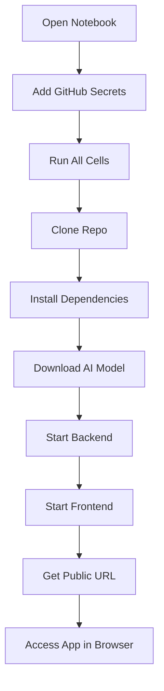

# 🤖 Reflectly - Google Colab Edition

> **Run the entire Reflectly app in Google Colab without installing anything locally!**

This branch is specifically configured to run Reflectly in Google Colab without needing ngrok or any external services.

## ⚡ Super Quick Start

1. **[Click here to open the notebook in Colab](https://colab.research.google.com/github/iNVISIBLExtanx/reflectly/blob/colab-integration/Reflectly_Colab.ipynb)** 

2. **Add your GitHub credentials** (one-time setup):
   - Click 🔑 in the left sidebar
   - Add `GITHUB_USERNAME` and `GITHUB_TOKEN`
   - Enable notebook access

3. **Click "Runtime → Run all"**

4. **Wait 10-15 minutes** for setup

5. **Click the frontend URL** that appears

That's it! 🎉

---

## 📁 Files in This Branch

| File | Purpose |
|------|---------|
| **[Reflectly_Colab.ipynb](./Reflectly_Colab.ipynb)** | 📓 Ready-to-use Colab notebook |
| **[COLAB_SETUP.md](./COLAB_SETUP.md)** | 📖 Detailed setup instructions |
| **[README_COLAB.md](./README_COLAB.md)** | 🔧 Technical documentation |
| `backend/` | Flask API and AI logic |
| `frontend/` | React UI |

## 🎯 What You Get

- ✅ Full Reflectly app running in the cloud
- ✅ AI-powered emotion analysis (Mistral 7B)
- ✅ Memory graph visualization
- ✅ Algorithm comparison features
- ✅ No installation required
- ✅ Free to use (with Colab limits)

## 🚀 How It Works



## 💡 Key Features

### No ngrok Required
Uses Google Colab's built-in port forwarding:
```python
frontend_url = eval_js("google.colab.kernel.proxyPort(3000)")
```

### Automatic Setup
Everything is automated in the notebook cells:
- Python dependencies
- Node.js installation
- Ollama and Mistral model
- Backend and frontend servers

### Resource Efficient
Runs on Colab's free tier:
- ~6-8 GB RAM used
- ~5 GB disk space
- No GPU needed

## 📊 Running Timeline

| Step | Time | What's Happening |
|------|------|------------------|
| Cells 1-3 | 2-3 min | Installing dependencies |
| Cell 4 | 5 sec | Starting Ollama |
| **Cell 5** | **5-10 min** | **Downloading Mistral model** ⏳ |
| Cell 6 | 10 sec | Starting backend |
| Cells 7-8 | 1-2 min | Building frontend |
| Cell 9 | Instant | Getting URLs |

**Total: ~10-15 minutes** (first time)

## 🔧 Troubleshooting

### "Backend not responding"
```python
!cat /tmp/backend.log
!pkill -9 -f intelligent_agent.py
# Re-run Cell 6
```

### "Frontend won't load"
```python
!cat /tmp/frontend.log
%cd /content/reflectly/frontend
!npm install
# Re-run Cell 8
```

### "Colab disconnected"
Just re-run from Cell 4 onwards (Ollama). The model should be cached.

## 📖 Documentation

- **[COLAB_SETUP.md](./COLAB_SETUP.md)** - Complete setup guide with all cell code
- **[README_COLAB.md](./README_COLAB.md)** - Technical details and architecture
- **[Original README](./README.md)** - About Reflectly project

## 🎓 Learning Resources

### New to Colab?
- [Google Colab Basics](https://colab.research.google.com/notebooks/intro.ipynb)
- [Colab FAQ](https://research.google.com/colaboratory/faq.html)

### Need a GitHub Token?
- [Create Personal Access Token](https://github.com/settings/tokens)
- Permissions needed: `repo` (full control of private repositories)

## ⚙️ Customization

### Change the AI Model
Edit Cell 5:
```python
!ollama pull llama2:7b  # Use Llama instead
```

### Modify Backend Port
Edit Cell 6:
```python
# Change port in intelligent_agent.py
# Then update frontend to match
```

## 🔄 Updates

To get the latest changes:
1. Restart Colab runtime
2. Re-run all cells
3. The notebook will pull the latest code

## 🌟 Differences from Main Branch

| Feature | Main Branch | Colab Branch |
|---------|-------------|--------------|
| Setup | Manual installation | Automated notebook |
| Access | localhost only | Public via Colab |
| Requirements | Local resources | Cloud resources |
| ngrok | Optional | Not needed |
| Duration | Unlimited | ~12 hours session |

## 🚦 Status Indicators

When running, you'll see:
- 🟢 **Green** - Everything working
- 🟡 **Yellow** - Starting up
- 🔴 **Red** - Error (check logs)

## 💰 Cost

**Completely FREE** using Google Colab's free tier!

Limitations:
- 12-hour max runtime
- 90-minute idle timeout
- Shared GPU access (not needed for this app)

## 🤝 Contributing

To improve the Colab integration:
1. Fork the repository
2. Create a branch from `colab-integration`
3. Make your changes
4. Test in Colab
5. Submit a pull request

## 📞 Support

Having issues?
1. Check [COLAB_SETUP.md](./COLAB_SETUP.md) troubleshooting section
2. Review error logs in the notebook
3. Open an issue with:
   - Error message
   - Cell that failed
   - Screenshot if possible

## ⭐ Quick Links

- 📓 [Open in Colab](https://colab.research.google.com/github/iNVISIBLExtanx/reflectly/blob/colab-integration/Reflectly_Colab.ipynb)
- 📖 [Setup Guide](./COLAB_SETUP.md)
- 🔧 [Technical Docs](./README_COLAB.md)
- 🏠 [Main Branch](https://github.com/iNVISIBLExtanx/reflectly)

---

**Made with ❤️ for easy deployment in Google Colab**

> **Note**: For production use or permanent deployment, please use the main branch with proper hosting.
